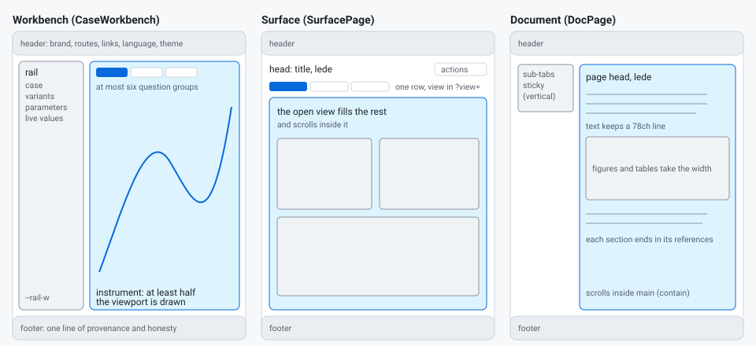

# 01 Structure: the frame, its areas, the route types and the viewport

## The frame (`AppShell`)

Every route sits in the same frame, top to bottom:

| Area | Element | Contents | Size |
|---|---|---|---|
| Skip link | `a.skip-link` | "Skip to the content", the first keyboard stop; visible only when focused | none until focused |
| Header | `header.site-header` | brand (mark and name), the route row, icon links (source, personal site, portfolio, architecture), language, theme | `--header-h` (56 px; 52 px at 760 px and below) |
| Main | `main.page#main` | the route body: a workbench, a surface or a document | what the header and footer leave |
| Footer | `footer.site-footer` | one line: product, the CAOS line, version and build, attribution, provenance, source, licence, disclaimer | compact (about 30 px) when the route is the viewport |

The header and footer strings, icons and links are the shell's (`chrome.ts`); a product passes only its name, mark,
routes, version, build, licence, visibility, architecture and footer provenance (`ShellConfig`).

## Three modes

| Mode | `ShellConfig` | What scrolls |
|---|---|---|
| default | (nothing) | the document; the header sticks to the top |
| fixed | `fixed: true`, or `fixedRoutes: ['/explore']` | the listed routes are the viewport; others scroll as documents |
| contain | `contain: true` (the template's configuration) | every route is the viewport: a workbench or a surface fills it, a document scrolls inside `main`, so the header and footer stay in view; below 900 px the document scrolls as a whole |

## Three route types

| Type | Component | Use it for | Body |
|---|---|---|---|
| Workbench | `CaseWorkbench` (on `WorkbenchLayout`) | the App route of a product about cases: one case at a time, its variants, its parameters | a rail (`--rail-w`) beside the instrument; the instrument holds at most six question groups and takes at least half the viewport (ADR-0071 rule 8) |
| Surface | `SurfacePage` | an App that is not one case's: a hub, an explorer, a console | a head (title, lede, actions), one row of at most six views, the open view filling the rest and scrolling inside |
| Document | `DocPage` and `DocSection` | Introduction, Methodology, Implementation, Experiments, Benchmark | a centred column of `--maxw` (1200 px), or `wide` with a vertical sub-tab list; text blocks keep a `--measure-text` (78ch) line |

Two special frames sit beside these: `FocusShell` (a full-viewport scenario, ADR-0070) and `WorkbenchShell` (an
authenticated console with a sidebar and a phone bottom bar).

The six standard routes are `STANDARD_ROUTES`: the App (`/`) and the five documentation routes, in that order. The
header, the router and the gate read the same list.

## Viewport and breakpoints

One set of widths, used by the stylesheet and exported as `BREAKPOINTS`:

| Width | Name | What changes |
|---|---|---|
| 480 px | `phone` | the brand keeps only its mark; the header drops its separators and the language code |
| 760 px | `compact` | the compact header; single-column grids; the vertical sub-tab list becomes a row; tables wrap their cells |
| 900 px | `stack` | the workbench stacks its rail over the instrument; a contained document scrolls as a whole; a views row stacks and a filling view takes a fixed readable height |
| 1280 px | `large` | the gate's large screen: from here up the route must be the viewport and the instrument at least half of it (ADR-0071) |

A product never adds a breakpoint of its own for the frame, the rows or the route bodies; a drawing that needs a
compact form reads `BREAKPOINTS` or measures its own box (`useStageSize`).

## Rules the structure keeps (and the gate measures)

- The document never scrolls sideways (`html, body { overflow-x: clip }`; G5). `clip`, not `hidden`: `hidden` made
  body a scroll container that never scrolls, and nothing could stick to the viewport (known shell defect 26).
- Every row of links or tabs is one line that scrolls, fades its hidden end and never shrinks (03 Navigation; G5,
  ADR-0071 rule 4).
- The rail never scrolls on a large screen; a rail that does not fit is split into sections (ADR-0071 rule 6).
- Nothing is cut: a container that clips its content fails G5; a label cut at a drawing's edge fails G10.
- The route is the viewport at 1280 px and above when the mode says so (ADR-0071 rule 1).
